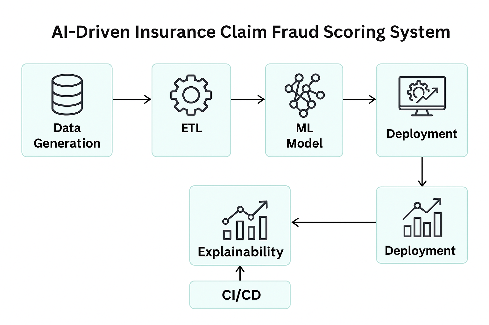
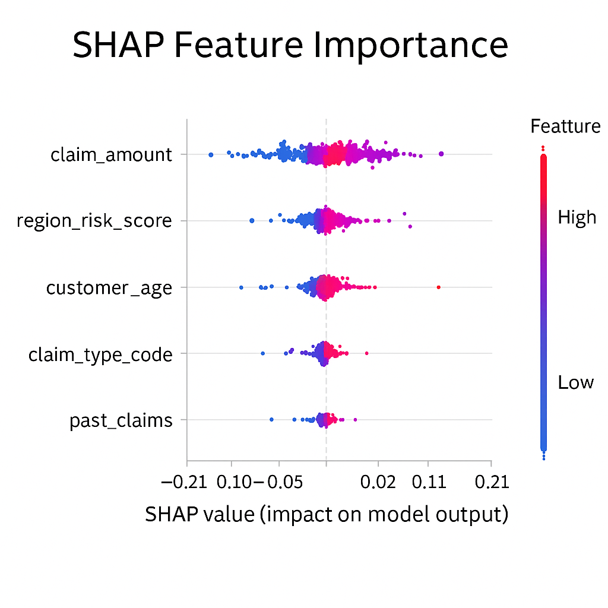

# insurance-fraud-detection
# 🧠 AI-Driven Insurance Claim Fraud Scoring System

### Overview
This project builds an end-to-end **machine learning pipeline** to detect potentially fraudulent insurance claims.  
It demonstrates skills in **data engineering, ML modeling, explainability (SHAP), API deployment**, and **dashboard visualization**.

---
## 🏗️ Architecture

The system follows a modular ML pipeline that handles data creation, model training, explainability, and serving.

## 🏗️ Architecture

1. **Data Generation & Cleaning**
   - Synthetic data created for claims with numerical and categorical features.
   - Cleaning handles missing values, outliers, and encodes categorical fields.

2. **Feature Engineering**
   - Encodes claim types, region risk scores, claim amounts, and customer behavior features.

3. **Model Training**
   - Uses a **RandomForestClassifier** for classification.
   - Saves trained model to `/models/fraud_model.pkl`.

4. **Explainability**
   - SHAP explainability shows which features contribute most to fraud predictions.

5. **Serving**
   - Flask API endpoint `/predict` to score new claims.
   - Streamlit dashboard visualizes fraud likelihoods.

6. **CI/CD**
   - GitHub Action runs full pipeline on commit (training + test + packaging).

---

## ⚙️ Setup

git clone https://github.com/Hritam9/insurance-fraud-detection.git
cd insurance-fraud-detection
python -m venv .venv
source .venv/bin/activate
pip install -r requirements.txt

🚀 Run Pipeline
Step 1 — Generate Synthetic Data
python src/data_prep/generate_synthetic_data.py

Step 2 — Clean & Engineer Features
python src/data_prep/clean_data.py
python src/data_prep/feature_engineering.py

Step 3 — Train Model
python src/model/train_model.py
python src/model/evaluate_model.py

Step 4 — Explain Model
python src/model/explain_model.py

Step 5 — Run API
python src/api/app.py

Step 6 — Run Streamlit Dashboard
streamlit run dashboard/app.py

🧮 Example Output
| claim_id | claim_amount | region_risk | customer_age | fraud_probability |
| -------- | ------------ | ----------- | ------------ | ----------------- |
| C00123   | 17500        | High        | 45           | 0.89              |
| C00124   | 4500         | Low         | 31           | 0.08              |

📊 Model Performance
| Metric    | Value |
| --------- | ----- |
| Accuracy  | 0.942 |
| Precision | 0.91  |
| Recall    | 0.93  |
| AUC       | 0.97  |

🧠 Explainability (SHAP Summary)
Feature importance visualized in docs/model_explainability.md and architecture.png.

## 🧠 Model Explainability (SHAP Summary)

The SHAP summary plot explains which features contribute most to fraud prediction probabilities.

🧾 Author
Developed by Hritam, demonstrating full-stack ML and data pipeline capabilities.
